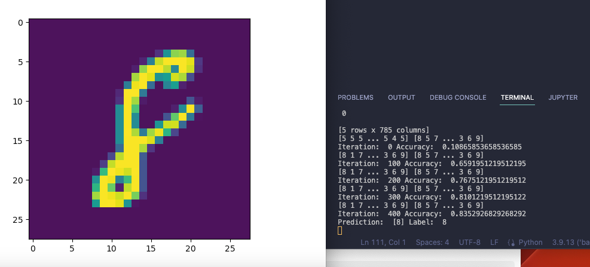

# Simple MNIST NN from scratch using numpy

Thanks to [Samson Zhang](https://www.kaggle.com/code/wwsalmon/simple-mnist-nn-from-scratch-numpy-no-tf-keras/notebook) for the amazing tutorial.

As you see in the screenshot above, the model is able to predict the handwritten digits with 83% accuracy. This is not bad for a model that is trained from scratch using only numpy. But we can do better.

